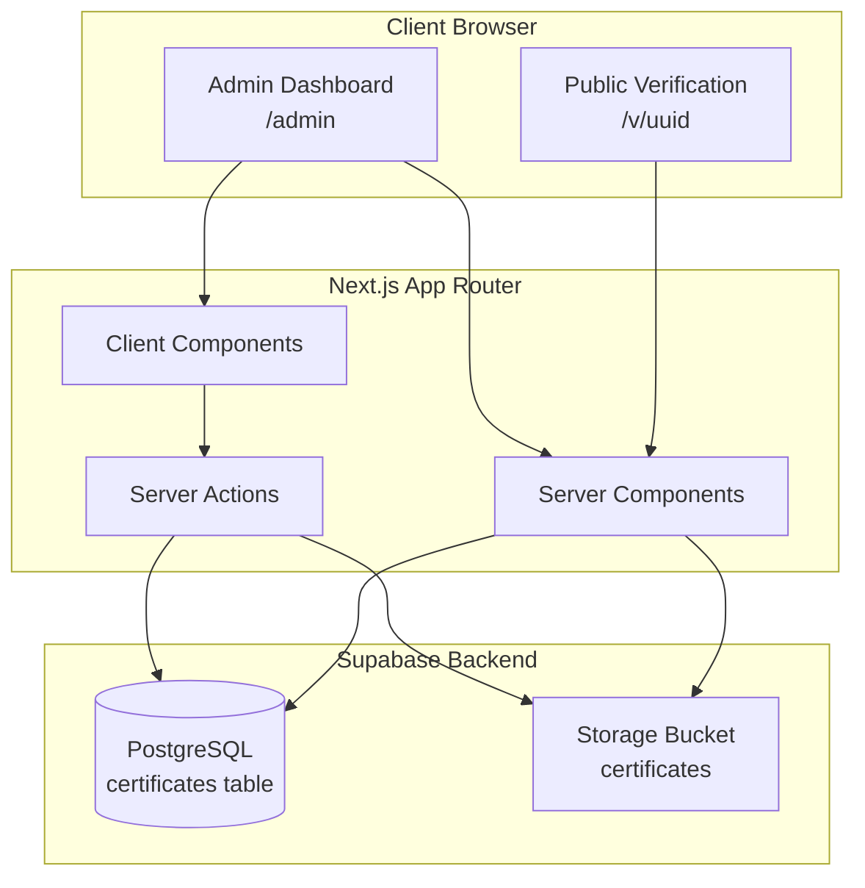
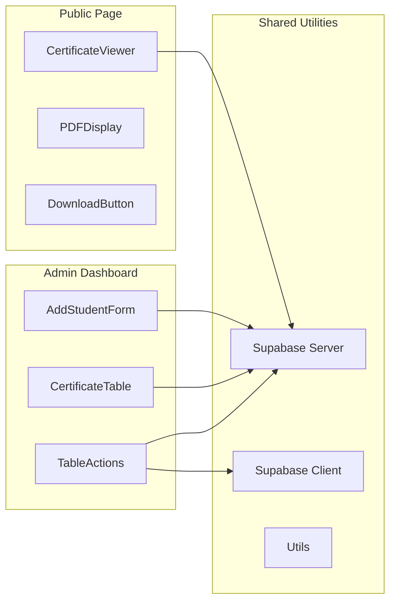
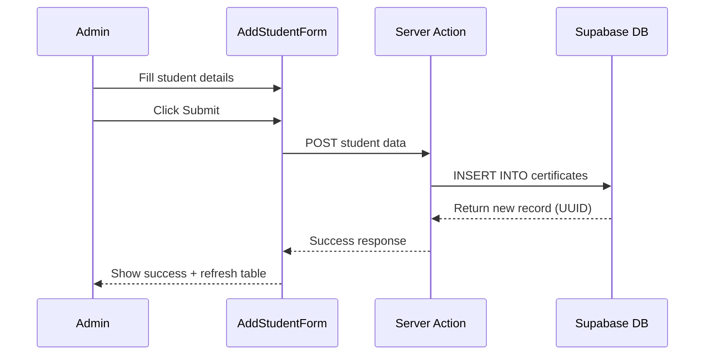
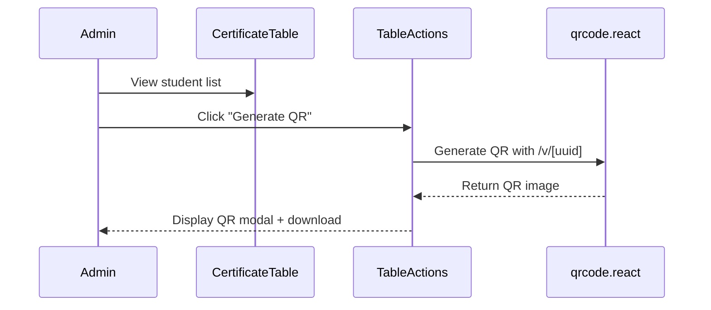
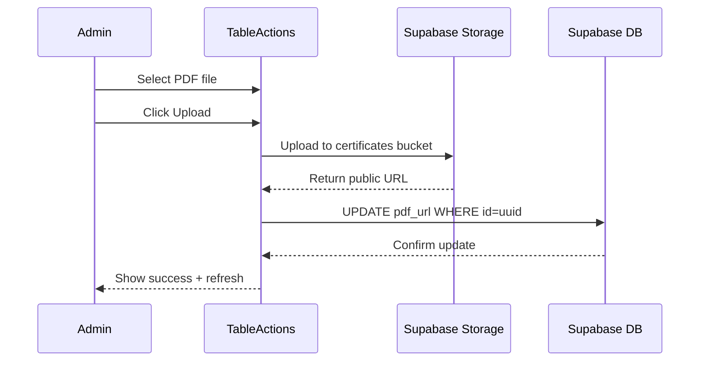
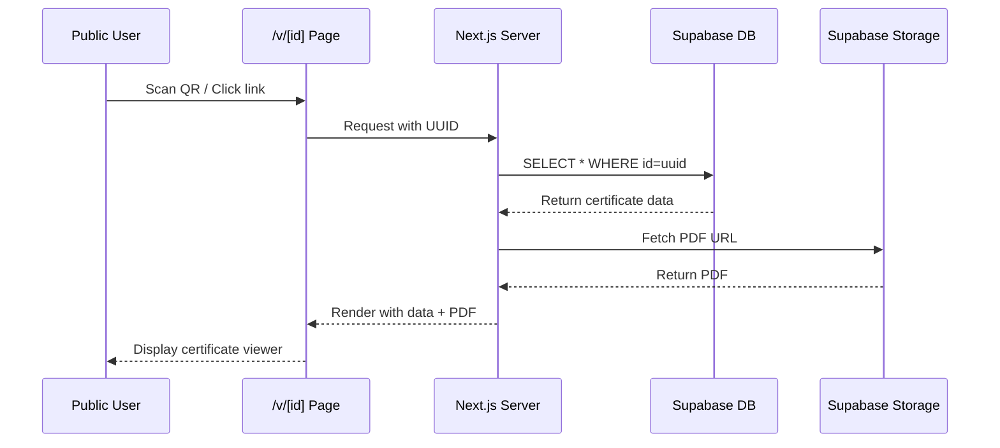
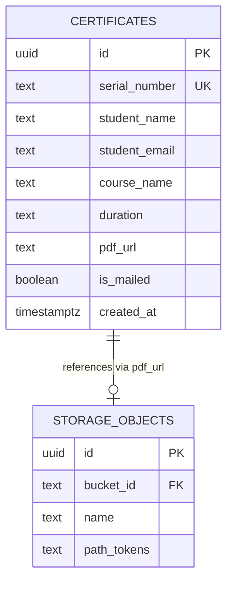

# Design Specifications
## Rycene Credential Management System

---

## 1. System Architecture

### High-Level Architecture



### Component Architecture



---

## 2. Data Flow Diagrams

### Add Student Flow



### QR Code Generation Flow



### PDF Upload Flow



### Public Verification Flow



---

## 3. Wireframes

### Admin Dashboard (`/admin`)

```
┌─────────────────────────────────────────────────────────────┐
│  Rycene Credential Management System - Admin Dashboard      │
├─────────────────────────────────────────────────────────────┤
│                                                              │
│  ┌──────────────────────────────────────────────────────┐  │
│  │  Add New Student                                      │  │
│  ├──────────────────────────────────────────────────────┤  │
│  │  Serial Number: [________________]                    │  │
│  │  Student Name:  [________________]                    │  │
│  │  Email:         [________________]                    │  │
│  │  Course:        [________________]                    │  │
│  │  Duration:      [________________]                    │  │
│  │                                                        │  │
│  │                              [Add Student Button]     │  │
│  └──────────────────────────────────────────────────────┘  │
│                                                              │
│  ┌──────────────────────────────────────────────────────┐  │
│  │  All Certificates                                     │  │
│  ├────┬─────────┬────────┬────────┬────────┬───────────┤  │
│  │ S# │ Name    │ Email  │ Course │ PDF    │ Actions   │  │
│  ├────┼─────────┼────────┼────────┼────────┼───────────┤  │
│  │001 │ John D. │ j@...  │ VLSI   │ ✓      │[QR][UP][✉]│  │
│  │002 │ Jane S. │ jane@..│ Verilog│ ✗      │[QR][UP][✉]│  │
│  │003 │ Bob M.  │ bob@.. │ FPGA   │ ✓      │[QR][UP][✉]│  │
│  └────┴─────────┴────────┴────────┴────────┴───────────┘  │
│                                                              │
│  Legend: [QR]=Generate QR  [UP]=Upload PDF  [✉]=Send Mail  │
└─────────────────────────────────────────────────────────────┘
```

### Public Verification Page (`/v/[uuid]`)

```
┌─────────────────────────────────────────────────────────────┐
│                                                              │
│              🎓 Rycene VLSI Technologies                     │
│                  Certificate Verification                    │
│                                                              │
├─────────────────────────────────────────────────────────────┤
│                                                              │
│  Student Name:    John Doe                                  │
│  Course:          Advanced VLSI Design                      │
│  Duration:        6 Months                                  │
│  Serial Number:   RYC-2026-001                              │
│  Issued:          February 13, 2026                         │
│                                                              │
│  ┌──────────────────────────────────────────────────────┐  │
│  │                                                       │  │
│  │                                                       │  │
│  │              [PDF Certificate Preview]                │  │
│  │                                                       │  │
│  │                    (iframe viewer)                    │  │
│  │                                                       │  │
│  │                                                       │  │
│  └──────────────────────────────────────────────────────┘  │
│                                                              │
│                    [📥 Download Certificate]                │
│                                                              │
│  Share this achievement:  [LinkedIn] [Twitter] [Copy Link] │
│                                                              │
└─────────────────────────────────────────────────────────────┘
```

---

## 4. Database Design

### Entity Relationship Diagram



### Indexes & Constraints

```sql
-- Primary Key
PK: certificates.id (UUID)

-- Unique Constraints
UNIQUE: certificates.serial_number

-- Indexes (for performance)
CREATE INDEX idx_certificates_created_at ON certificates(created_at DESC);
CREATE INDEX idx_certificates_email ON certificates(student_email);

-- Foreign Key (implicit via pdf_url)
certificates.pdf_url -> storage.objects.path
```

---

## 5. API Design

### Server Actions

#### `addStudent(formData: FormData)`
- **Purpose**: Create new student record
- **Input**: FormData with serial_number, student_name, student_email, course_name, duration
- **Output**: `{ success: boolean, data?: Certificate, error?: string }`
- **Side Effects**: INSERT into certificates table

#### `uploadCertificatePDF(uuid: string, file: File)`
- **Purpose**: Upload PDF to storage and update record
- **Input**: Student UUID, PDF File object
- **Output**: `{ success: boolean, url?: string, error?: string }`
- **Side Effects**: Upload to storage, UPDATE pdf_url

#### `getCertificates()`
- **Purpose**: Fetch all certificates for admin table
- **Input**: None
- **Output**: `Certificate[]`
- **Side Effects**: None (read-only)

### Server-Side Data Fetching

#### `getCertificateByUUID(uuid: string)`
- **Purpose**: Fetch single certificate for public page
- **Input**: UUID from URL params
- **Output**: `Certificate | null`
- **Side Effects**: None (read-only)

---

## 6. UI Component Specifications

### AddStudentForm Component
- **Type**: Client Component (`'use client'`)
- **State**: Form fields (serial_number, student_name, student_email, course_name, duration)
- **Events**: onSubmit → calls addStudent server action
- **Validation**: All fields required, email format validation
- **Feedback**: Success toast, error messages, loading state

### CertificateTable Component
- **Type**: Server Component
- **Props**: `certificates: Certificate[]`
- **Features**: 
  - Responsive table layout
  - Conditional rendering for PDF status
  - Row-level actions via TableActions component
- **Styling**: Tailwind table classes, alternating row colors

### TableActions Component
- **Type**: Client Component
- **Props**: `certificate: Certificate`
- **Features**:
  - **Generate QR**: Opens modal with QR code, download button
  - **Upload PDF**: File input, progress indicator, success feedback
  - **Send Mail**: Console log placeholder, disabled state if no PDF
- **State**: Modal open/close, upload progress, loading states

### CertificateViewer Component
- **Type**: Server Component
- **Props**: `certificate: Certificate`
- **Features**:
  - Student details display
  - PDF iframe viewer (responsive height)
  - Download button
  - Social sharing buttons (future)
- **Error Handling**: 404 state for invalid UUID

---

## 7. Security Design

### Row Level Security (RLS) Policies

```sql
-- Public read access for verification page
CREATE POLICY "public_read_certificates"
ON certificates FOR SELECT
USING (true);

-- Storage bucket public read
CREATE POLICY "public_read_storage"
ON storage.objects FOR SELECT
USING (bucket_id = 'certificates');
```

### Route Isolation
- **Admin Routes**: No authentication in Phase 1 (add in Phase 2)
- **Public Routes**: No links/navigation to admin
- **Storage**: Public bucket for PDFs (no sensitive data in filenames)

---

## 8. Social Sharing Design

### Open Graph Meta Tags

```html
<meta property="og:type" content="website" />
<meta property="og:title" content="Certificate - [Student Name] - [Course]" />
<meta property="og:description" content="Verified certificate from Rycene VLSI Technologies for [Course] ([Duration])" />
<meta property="og:url" content="https://[domain]/v/[uuid]" />
<meta property="og:image" content="https://[domain]/og-image.png" />
<meta property="og:site_name" content="Rycene VLSI Technologies" />

<meta name="twitter:card" content="summary_large_image" />
<meta name="twitter:title" content="Certificate - [Student Name] - [Course]" />
<meta name="twitter:description" content="Verified certificate from Rycene VLSI Technologies" />
<meta name="twitter:image" content="https://[domain]/og-image.png" />
```

### Dynamic Metadata Generation

```typescript
export async function generateMetadata({ params }): Promise<Metadata> {
  const certificate = await getCertificateByUUID(params.id);
  
  return {
    title: `Certificate - ${certificate.student_name}`,
    description: `Verified certificate for ${certificate.course_name}`,
    openGraph: {
      title: `${certificate.student_name} - ${certificate.course_name}`,
      description: `Completed ${certificate.course_name} (${certificate.duration})`,
      type: 'website',
      url: `/v/${params.id}`,
    },
  };
}
```

---

## 9. File Structure

```
rycene-portal/
├── app/
│   ├── admin/
│   │   └── page.tsx                 # Admin dashboard (Server Component)
│   ├── v/
│   │   └── [id]/
│   │       └── page.tsx             # Public verification (Server Component + Metadata)
│   ├── layout.tsx                   # Root layout with Tailwind
│   ├── page.tsx                     # Home page (redirect to admin)
│   └── globals.css                  # Tailwind directives
├── components/
│   ├── admin/
│   │   ├── AddStudentForm.tsx       # Client Component
│   │   ├── CertificateTable.tsx     # Server Component
│   │   └── TableActions.tsx         # Client Component
│   └── ui/
│       └── (optional shadcn components)
├── lib/
│   ├── supabase/
│   │   ├── client.ts                # Browser client
│   │   ├── server.ts                # Server client
│   │   └── schema.sql               # Database schema
│   ├── actions/
│   │   └── certificates.ts          # Server actions
│   └── utils.ts                     # Helper functions
├── public/
│   └── og-image.png                 # Default OG image
├── .env.local                       # Environment variables (gitignored)
├── .env.example                     # Template
├── package.json
├── tailwind.config.ts
├── tsconfig.json
└── README.md
```

---

## 10. Styling Guidelines

### Tailwind Design Tokens

```typescript
// Color Palette (Functional, not beautified)
- Background: bg-gray-50, bg-white
- Text: text-gray-900, text-gray-600
- Borders: border-gray-200
- Primary Action: bg-blue-600, hover:bg-blue-700
- Success: bg-green-600
- Error: bg-red-600

// Typography
- Headings: text-2xl font-bold
- Body: text-base
- Labels: text-sm font-medium

// Spacing
- Container: max-w-7xl mx-auto px-4
- Section gaps: space-y-6
- Form gaps: space-y-4
```

### Component Styling Patterns

```tsx
// Button
className="px-4 py-2 bg-blue-600 text-white rounded hover:bg-blue-700"

// Input
className="w-full px-3 py-2 border border-gray-300 rounded focus:outline-none focus:ring-2 focus:ring-blue-500"

// Table
className="min-w-full divide-y divide-gray-200"
```
